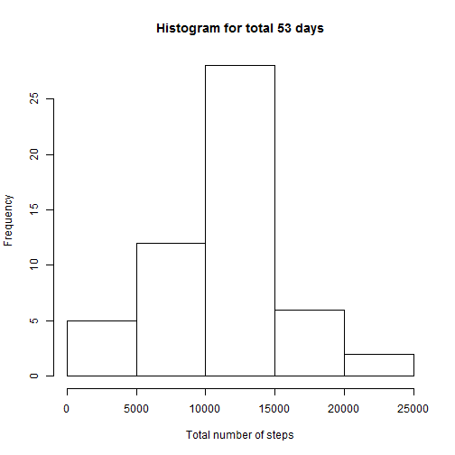
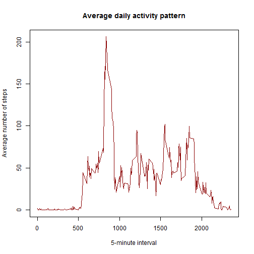
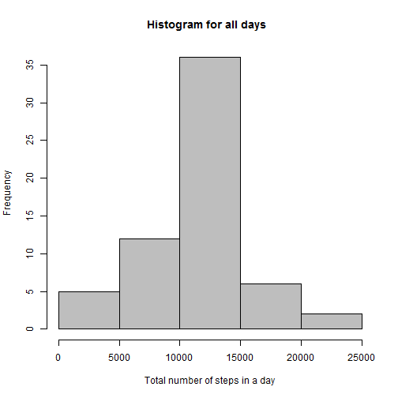
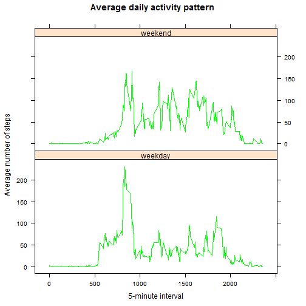

## Loading and preprocessing the data

```r
# Load 'knitr' library
library("knitr")
# Read raw data 
activity.data.raw <- read.csv("./activity.csv", header=TRUE,na.strings = "NA", stringsAsFactors = FALSE)

# Clean the dataset
# Take only the rows that have no NA values
ok <- complete.cases(activity.data.raw)

# Modified dataset without 'missing value' rows
activity.data.modified <- activity.data.raw[ok,]
```
## What is mean total number of steps taken per day?


```r
# Change "date" column from 'character' type to 'Date' type
activity.data.modified$date <- as.Date(activity.data.modified$date)

# Calculate 'total number of steps' for each date
# Group the data according to "date" column and apply function 'sum' to 
# the "steps" column in each group
total.steps.in.a.day <- aggregate(steps ~ date, data=activity.data.modified, FUN=sum)

# Create a histogram plot on the 'total number of steps'
hist(total.steps.in.a.day[,2], main = "Histogram for 53 days (Excluding 'Missing Value' Days) ",col = "lightblue",
     xlab = "Total number of steps in a day")
```

 

```r
# mean and median total number of steps taken per day
mean.total.steps <- mean (total.steps.in.a.day[,2])
median.total.steps <- median (total.steps.in.a.day[,2])
```
The **mean** is 1.0766189 &times; 10<sup>4</sup> and the **median** is 10765

## What is the average daily activity pattern?

```r
# 'Average number of steps' for each '5-minute interval'
average.data <- aggregate(steps ~ interval, data=activity.data.modified, FUN=mean)

# Plot '5-minute interval'(x-axis) against Average number of steps' (y-axis)
plot(average.data$interval, average.data$steps, type="l", main="Average daily activity pattern", 
     xlab="5-minute interval", ylab="Average number of steps",col = "dark red")
```

 

```r
# Which 5-minute interval is having the maximum average number of steps
max.five.minute.interval <- which.max(average.data$steps)
```
 104  **-th 5-minute interval**, on average across all the days in the dataset, contains the maximum number of steps

## Imputing missing values


```r
# Total number of rows with NAs
not.ok <- sum(!ok)
```
Total number of rows with **missing values (NAs)** is 2304

**Strategy:Missing values are filled with mean for that 5-minute interval** 


```r
# New data set that would be in future filled with some values 
activity.data.raw.copy <- activity.data.raw

# Variable to iterate over rows
row.number <- 1L

for (i in average.data$interval){
    # Which row indices have the 'particular' 5-minute interval
    indices <- which(activity.data.raw.copy$interval == i)
    # Among the rows found above, which are the ones having
    # NA in 'steps' column
    indices <- indices[is.na(activity.data.raw.copy[indices,1])]
    # Fill those NA values with 'mean number of steps' calculated earlier
    # for that 5-minute interval
    activity.data.raw.copy[indices,1] <- average.data[row.number,2]
    # Increment row number
    row.number <- row.number + 1
}
```
Make a histogram of the total number of steps taken each day for the new  data with NO 'missing values'

```r
# Change "date" column from 'character' type to 'Date' type
activity.data.raw.copy$date <- as.Date(activity.data.raw.copy$date)

# Calculate 'total number of steps' for each date
# Group the data according to "date" column and apply function 'sum' to 
# the "steps" column in each group
total.steps.in.a.day.complete.data <- aggregate(steps ~ date, data=activity.data.raw.copy, FUN=sum)

# Create a histogram plot on the 'total number of steps'
hist(total.steps.in.a.day.complete.data[,2], main = "Histogram for all days  ",col = "gray", 
     xlab = "Total number of steps in a day")
```

 

```r
# mean and median total number of steps taken per day
mean.total.steps.complete.data <- mean (total.steps.in.a.day.complete.data[,2])
median.total.steps.complete.data <- median (total.steps.in.a.day.complete.data[,2])
```

The **mean** is 1.0766189 &times; 10<sup>4</sup> and the **median** is 1.0766189 &times; 10<sup>4</sup>

**Mean and Median Comparison (for non-imputed and imputed dataset)**


```r
# Concatenate the means calculated into a single vector
mean.vector <- c(mean.total.steps,mean.total.steps.complete.data)

# Concatenate the medians calculated into a single vector
median.vector <- c(median.total.steps,median.total.steps.complete.data)

# Create a data.frame with the above vectors as columns
mean.median.table <- data.frame(mean.vector, median.vector, row.names = 
    c("Without imputing missing values",  "Imputing missing values") )

names(mean.median.table) <- c("Mean", "Median")

# This library is used to print a table in html file
library("xtable")
disp.table <- xtable(mean.median.table)
print(disp.table,type = "html")
```

<!-- html table generated in R 3.1.1 by xtable 1.7-4 package -->
<!-- Sat Jan 17 22:17:46 2015 -->
<table border=1>
<tr> <th>  </th> <th> Mean </th> <th> Median </th>  </tr>
  <tr> <td align="right"> Without imputing missing values </td> <td align="right"> 10766.19 </td> <td align="right"> 10765.00 </td> </tr>
  <tr> <td align="right"> Imputing missing values </td> <td align="right"> 10766.19 </td> <td align="right"> 10766.19 </td> </tr>
   </table>
**Impact of imputing missing data on the estimates of the total daily number of steps**

```r
# Summary of 'without imputing' total number of steps
s1 <- summary(total.steps.in.a.day$steps)
s1 <- as.matrix(s1)
s1 <- data.frame(s1)
# Summary of 'with imputing' total number of steps
s2 <- summary(total.steps.in.a.day.complete.data$steps)
s2 <- as.matrix(s2)
s2 <- data.frame(s2)

s1 <- cbind(s1,s2[,1])
colnames(s1) <- c("Without imputing","With imputing" )

print(xtable(s1), type = "html")
```

<!-- html table generated in R 3.1.1 by xtable 1.7-4 package -->
<!-- Sat Jan 17 22:17:46 2015 -->
<table border=1>
<tr> <th>  </th> <th> Without imputing </th> <th> With imputing </th>  </tr>
  <tr> <td align="right"> Min. </td> <td align="right"> 41.00 </td> <td align="right"> 41.00 </td> </tr>
  <tr> <td align="right"> 1st Qu. </td> <td align="right"> 8841.00 </td> <td align="right"> 9819.00 </td> </tr>
  <tr> <td align="right"> Median </td> <td align="right"> 10760.00 </td> <td align="right"> 10770.00 </td> </tr>
  <tr> <td align="right"> Mean </td> <td align="right"> 10770.00 </td> <td align="right"> 10770.00 </td> </tr>
  <tr> <td align="right"> 3rd Qu. </td> <td align="right"> 13290.00 </td> <td align="right"> 12810.00 </td> </tr>
  <tr> <td align="right"> Max. </td> <td align="right"> 21190.00 </td> <td align="right"> 21190.00 </td> </tr>
   </table>
## Are there differences in activity patterns between weekdays and weekends?

```r
# Create a new factor variable 'type.of.day' with two levels
# 'weekday' and 'weekend'
activity.data.raw.copy$type.of.day <- as.factor(0)
levels(activity.data.raw.copy$type.of.day) <- c("weekday", "weekend")

# Convert date column to 'day of week' form
activity.data.raw.copy$date <- weekdays(activity.data.raw.copy$date)

# Differentiate weekend days from weekdays
activity.data.raw.copy$type.of.day[activity.data.raw.copy$date == "Saturday"] <- "weekend"
activity.data.raw.copy$type.of.day[activity.data.raw.copy$date == "Sunday"] <- "weekend"

# Average number of steps taken, averaged across all days 

# Use lattice library for plotting
library(package ="lattice")

# Group by interval and type.of.day and find mean (number of steps)
average.data.week <- aggregate(steps~interval+type.of.day, data=activity.data.raw.copy, FUN=mean)

# Plot with 2 panels
xyplot(average.data.week$steps ~ average.data.week$interval|average.data.weekday$type.of.day, type="l",
  main="Average daily activity pattern", xlab="5-minute interval", ylab="Average number of steps", 
  col = "green", layout = c(1,2))
```

 
