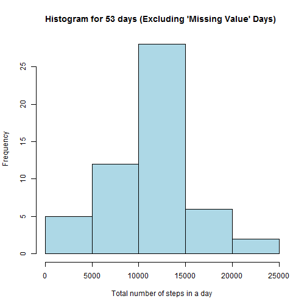

## Loading and preprocessing the data

```r
# Read raw data 
activity.data.raw <- read.csv("./activity.csv", header=TRUE,na.strings = "NA", stringsAsFactors = FALSE)

# Clean the data
# Take only the rows that have no NA values
activity.data.modified <- activity.data.raw[complete.cases(activity.data.raw),]
```
## What is mean total number of steps taken per day?


```r
# Change "date" column from 'character' type to 'Date' type
activity.data.modified$date <- as.Date(activity.data.modified$date)

# temp <- split(activity.data.modified,activity.data.modified$date)

# Calculate 'total number of steps' for each date
# Group the data according to "date" column and apply function 'sum' to 
# the "steps" column in each group
t <- by(activity.data.modified, activity.data.modified$date,function(m) sum(m$steps), simplify=FALSE)

# Convert the returned class type "by" to a "data frame"
df <- do.call(rbind.data.frame, t)

# Create a histogram plot on the 'total number of steps'
hist(df[,1], main = "Histogram for total 53 days", xlab = "Total number of steps")
```

 

```r
# mean and median total number of steps taken per day
mean.total.steps <- round(mean (df[,1]))
median.total.steps <- round(median (df[,1]))
```
The **mean** is 1.0766 &times; 10<sup>4</sup> and the **median** is 1.0765 &times; 10<sup>4</sup>


## What is the average daily activity pattern?


## Imputing missing values


## Are there differences in activity patterns between weekdays and weekends?
